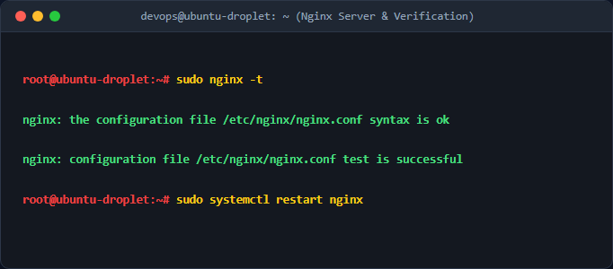
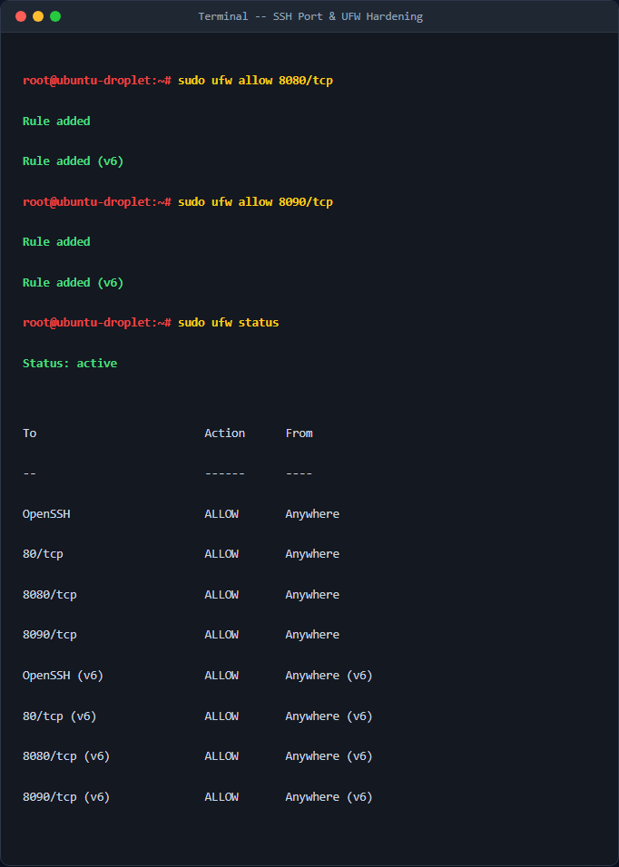
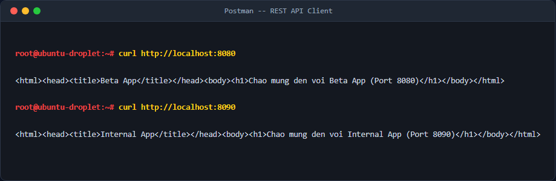

# Bài 4: Chạy song song nhiều cổng dịch vụ Nginx Virtual Hosts

## 1. Mục tiêu & Bối cảnh kỹ thuật
Tài liệu này ghi nhận quá trình triển khai cấu hình Nginx để chạy song song hai trang web tĩnh độc lập trên cùng một địa chỉ IP máy chủ ảo (Droplet) bằng cách phân chia cổng dịch vụ: cổng 8080 cho Beta App và cổng 8090 cho Internal App. Đồng thời cấu hình tường lửa UFW để mở các cổng này.

## 2. Các bước thực hiện chi tiết

### Bước 1: Tạo cấu trúc thư mục lưu trữ mã nguồn
Thực hiện tạo hai thư mục riêng biệt cho Beta App và Internal App:
```bash
sudo mkdir -p /var/www/beta-app/html
sudo mkdir -p /var/www/internal-app/html
```
- Lệnh `mkdir` với cờ `-p` giúp tạo toàn bộ cây thư mục cha nếu chưa tồn tại mà không báo lỗi.

### Bước 2: Tạo các file nội dung mẫu (index.html)
Tạo nội dung trang web cho từng ứng dụng:
```bash
echo '<html><head><title>Beta App</title></head><body><h1>Chao mung den voi Beta App (Port 8080)</h1></body></html>' | sudo tee /var/www/beta-app/html/index.html
echo '<html><head><title>Internal App</title></head><body><h1>Chao mung den voi Internal App (Port 8090)</h1></body></html>' | sudo tee /var/www/internal-app/html/index.html
```

### Bước 3: Cấu hình Nginx Virtual Hosts cho đa cổng
Tạo tệp cấu hình duy nhất `/etc/nginx/sites-available/multi-port.conf` chứa cả hai server block:
```bash
sudo nano /etc/nginx/sites-available/multi-port.conf
```
Nội dung tệp cấu hình:
```nginx
server {
    listen 8080;
    server_name _;
    root /var/www/beta-app/html;
    index index.html;
    location / {
        try_files $uri $uri/ =404;
    }
}

server {
    listen 8090;
    server_name _;
    root /var/www/internal-app/html;
    index index.html;
    location / {
        try_files $uri $uri/ =404;
    }
}
```

### Bước 4: Kích hoạt cấu hình Nginx
Liên kết tệp cấu hình sang thư mục `sites-enabled` và kiểm tra lỗi cú pháp:
```bash
sudo ln -s /etc/nginx/sites-available/multi-port.conf /etc/nginx/sites-enabled/
sudo nginx -t
sudo systemctl restart nginx
```


### Bước 5: Cấu hình tường lửa UFW
Mở các cổng 8080 và 8090 trên UFW:
```bash
sudo ufw allow 8080/tcp
sudo ufw allow 8090/tcp
sudo ufw status
```


## 3. Kiểm tra & Xác thực kết quả
Sử dụng lệnh `curl` để kiểm tra phản hồi từ các cổng:
```bash
curl http://localhost:8080
curl http://localhost:8090
```


## 4. Kết luận & Best Practices bảo mật vận hành
- Phân tách rõ ràng mã nguồn và cấu hình theo từng ứng dụng giúp dễ dàng quản lý và xử lý sự cố.
- Chỉ mở các cổng cần thiết trên tường lửa mạng (UFW và Cloud Firewall) nhằm hạn chế bề mặt tấn công.
- Thường xuyên kiểm tra cú pháp Nginx trước khi restart dịch vụ.